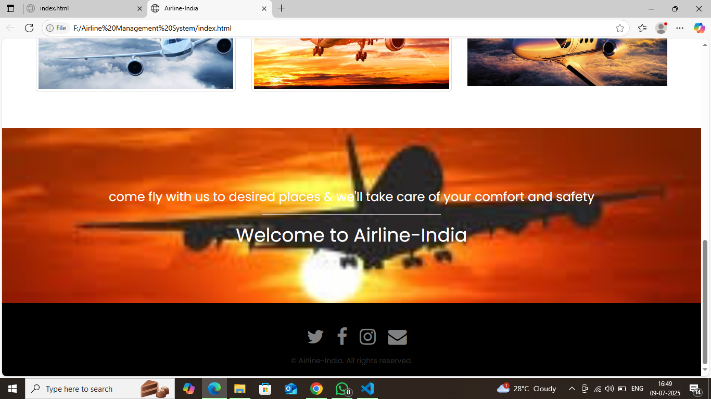
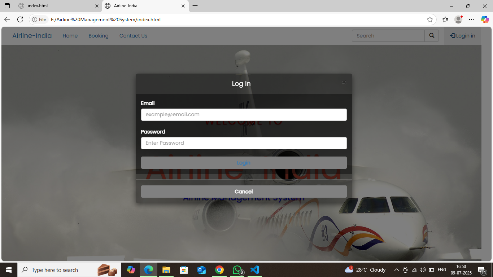

# ✈️ Airline Management System

An Airline Management System is a desktop/web-based application designed to streamline and automate various processes involved in managing airline operations such as flight scheduling, ticket booking, passenger management, staff management, and reporting. This project is ideal for learning full-stack development concepts and database integration.

## 📌 Table of Contents

- [Project Features](#-project-features)
- [Technologies Used](#-technologies-used)
- [Installation](#-installation)
- [Usage](#-usage)
- [Screenshots](#-screenshots)
- [Contributors](#-contributors)
- [License](#-license)

---

## 🚀 Project Features

- ✈️ Flight scheduling and updates  
- 🧑‍💼 Passenger registration and booking  
- 🎫 Ticket generation and cancellation  
- 🧑‍✈️ Staff and crew management  
- 📅 Real-time flight status and history  
- 📊 Admin dashboard with reports  
- 🔐 User authentication (Admin/Staff)  

---

## 🛠 Technologies Used

- **Frontend:** HTML, CSS, JavaScript  
- **Backend:** PHP  
- **Database:** MySQL
- **Other Tools:** XAMPP

---

## 💻 Installation

### Requirements
- Code editor (VS Code, Eclipse, etc.)
- XAMPP / WAMP (if PHP)
- MySQL
- Browser (Chrome, Firefox)

### Steps
1. Clone the repository or download the ZIP.
2. Import the project in your code editor.
3. Setup the database:
   - Open phpMyAdmin or your MySQL client
   - Import `airline_db.sql` from the `database` folder
4. Configure the database connection in your backend file:
   ```php
   // config.php
   $conn = new mysqli("localhost", "root", "", "airline_db")
   
##**📖 Usage**
The Airline Management System has three main types of users: Admin, Staff, and Passengers. Each role has specific permissions and actions available.

**🔐  Login System**
Admin Login: Access full system control (dashboard, flight management, user/staff handling, reports).

Staff Login: View assigned flights, manage check-ins, and passenger status.

Passenger Login: Book flights, view tickets, cancel bookings.

**🖼️ Screenshots**








##**👨‍💻 Contributors**
Amit Kumar Bind – MCA Final Year – AKTU

Guide: Dr. Abhishek Singh

Institute: Technical Education & Research Institute, Ghazipur

📄** License**
This project is for academic purposes. You are free to use and modify it for learning and development.


